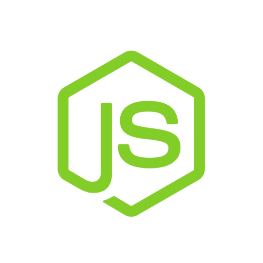

     

 

Me atrae la programación por su naturaleza multifacética: un punto de encuentro entre el arte de la creación, la precisión de la ciencia y el desafío constante de la resolución de problemas. Nunca dejo de estudiar, siempre estoy buscando expandir mis conocimientos y explorar nuevas tecnologías. Aunque soy relativamente nuevo en el mundo del desarrollo profesional, me siento como en casa. La lógica, la creatividad y la búsqueda de soluciones siempre han sido parte de mí, y encuentro en la programación el medio perfecto para expresarlas. También soy un lector voraz (y si, la ciencia ficción es una de mis favoritas).

## Tecnologías

 </img>    </img>    </img>    </img>    </img>    </img>    </img>    </img>    </img>    </img>    </img> 
 

 
 
 
 
